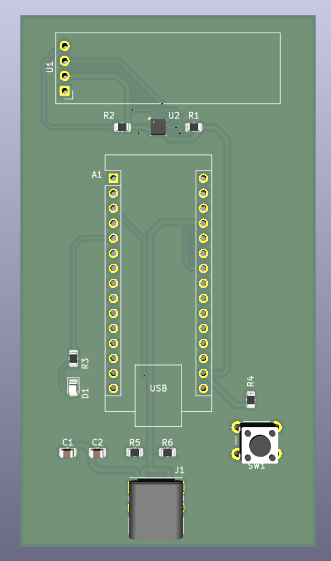

# PCB Design Portfolio – Fawaz

A collection of custom PCB projects designed in KiCad.

## Projects

* 🌈 RGB Mood Light PCB
* 🌤 ESP32 OLED Weather / System Display PCB

Each project folder contains:

* KiCad source files
* PCB screenshots
* 3D renders
* Project documentation (PDF)

## 🌈 RGB Mood Light PCB

## 🌤 ESP32 OLED Weather Display PCB

